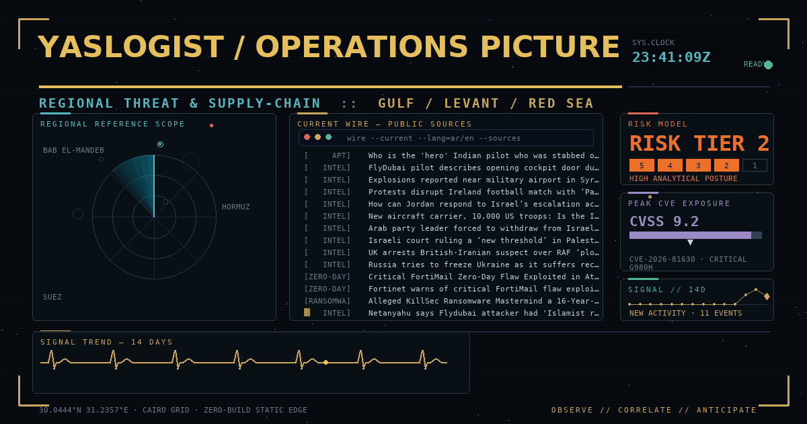
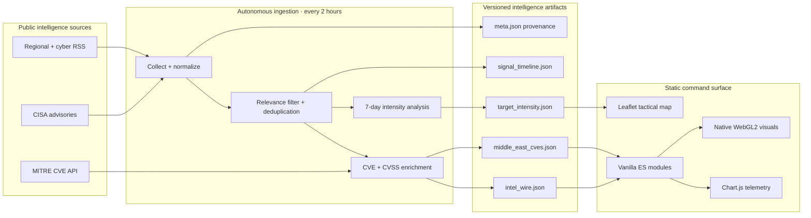
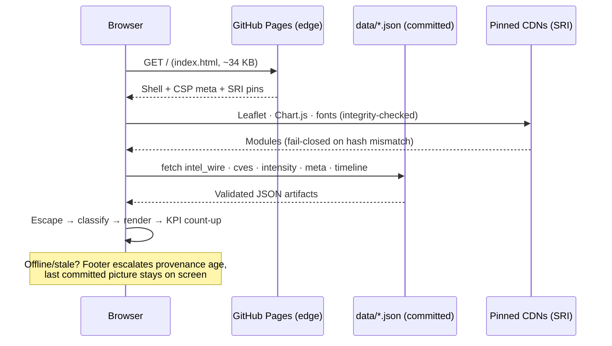

<div align="center">


# YASLOGIST Intelligence

### Sovereign CTI & Maritime Logistics Radar — Technical Whitepaper

**A bilingual, zero-build intelligence cockpit that turns open-source cyber, geopolitical, and maritime signals into an operator-ready common picture.**



[](https://yaslogist.github.io/yaslogist-intelligence/)
[](.github/workflows/update-data.yml)

[](CHANGELOG.md)
[](package.json)
[](#bilingual-by-design)
[](#1-system-architecture)
[](#deployment)

[**Launch Dashboard**](https://yaslogist.github.io/yaslogist-intelligence/) · [System Architecture](#1-system-architecture) · [Feature Matrix](#2-feature-matrix) · [Core Workflows](#3-core-workflows) · [Tech Stack](#4-tech-stack)

</div>

---

## Abstract

YASLOGIST Intelligence is a high-density command interface for monitoring Middle East cyber activity, geopolitical developments, critical vulnerabilities, and maritime supply-chain risk. It fuses a tactical map, a normalized OSINT wire, CVE enrichment, target-intensity telemetry, and threat-actor context into **one static application with no server component**.

The design premise is inversion: instead of the browser calling live APIs, a **scheduled Node.js pipeline** collects and structures public intelligence on a two-hour cadence and commits the result as versioned JSON. The browser receives preprocessed artifacts — not credentials, sessions, or API keys — and GitHub Pages serves the finished cockpit at the edge. Every screen can be regenerated or rolled back from Git history alone.

> [!IMPORTANT]
> YASLOGIST is an **open-source situational-awareness tool**, not a classified feed or an emergency warning system. Automated tags, scores, map layers, and DEFCON-style UI indicators are analytical aids. Validate consequential decisions against authoritative primary sources.

**Document map** — §1 [System Architecture](#1-system-architecture) · §2 [Feature Matrix](#2-feature-matrix) · §3 [Core Workflows](#3-core-workflows) · §4 [Tech Stack](#4-tech-stack) · §5 [Intelligence Dataset](#5-intelligence-dataset) · §6 [Security & Integrity](#6-security--integrity-model) · §7 [Bilingual Design](#7-bilingual-by-design) · §8 [Quick Start](#8-quick-start) · §9 [Repository Map](#9-repository-map) · §10 [Verification Ledger](#10-verification-ledger)

---

## 1. System Architecture

### 1.1 Design doctrine

Five principles govern every subsystem; nothing ships that violates one:

| # | Principle | Enforcement |
| :-: | :--- | :--- |
| 1 | **Static by default** — no application server, database, or runtime secret | Deployed artifact is the repository root; no server code exists to attack |
| 2 | **Zero-build frontend** — standards-based HTML/CSS/ES modules | `node --check` syntax gate; no bundler config anywhere in the tree |
| 3 | **Versioned intelligence** — telemetry committed as inspectable JSON | 5 artifacts under `data/`, schema-validated pre-commit, full history in Git |
| 4 | **Failure tolerant** — partial collection never blocks the picture | Per-feed isolation; empty collection never overwrites the existing wire |
| 5 | **Untrusted-input aware** — all feed content is hostile until escaped | HTML escaping + protocol allow-listing verified in the test suite |

### 1.2 Data-plane overview



### 1.3 Runtime request path

What happens between a visitor opening the URL and a live picture on screen — every hop is observable in DevTools, none involves a YASLOGIST server:



### 1.4 Trust boundaries

| Boundary | Trust level | Control |
| :--- | :--- | :--- |
| Feed XML / third-party APIs | **Zero** | Parsed defensively, escaped before DOM, links protocol-allow-listed |
| Committed `data/*.json` | **Validated** | Schema gate in CI; parsed with shape guards at render time |
| External scripts (Leaflet, Chart.js) | **Pinned** | Exact version + Subresource Integrity; CI fails on unpinned additions |
| First-party modules | **Audited** | `node --check`, 56-assertion test suite, security scanner per commit |

---

## 2. Feature Matrix

Operational capabilities, where each lives, and how it is proven. Nothing in this table is aspirational — **Status ✅ means shipped, wired, and covered by an automated gate.**

| Capability | Surface / Module | Data path | Verification | Status |
| :--- | :--- | :--- | :--- | :-: |
| **Live intelligence wire** — deduplicated, searchable by keyword / CVE / region / tag, with match highlighting and a NEW badge for intercepts < 3 h | `app.js` wire renderer | `data/intel_wire.json` (≤45 items) | Schema gate + dedup unit tests | ✅ |
| **Operator watchlist** — star any intercept; PINNED filter, persisted pins, watchlist section in the Markdown briefing | `app.js` watchlist layer | `localStorage` (bounded, sanitized) | Watchlist unit tests | ✅ |
| **Background live sync** — wire re-fetch every 10 min while visible; stale-tab refresh on focus; new-intercept toast | `app.js` live-sync scheduler | Wire feeds + committed JSON | Sync-state unit tests | ✅ |
| **Tactical threat map** — dark/satellite/ocean/topo basemaps, chokepoints, subsea infrastructure, corridors, range rings | `threat-map.js` (Leaflet) | `data/target_intensity.json` | Map-layer unit tests | ✅ |
| **CVE defense matrix** — feed-extracted CVEs enriched with MITRE records, CVSS, severity, product; live search + CVSS meters + CSV export | `app.js` matrix view | `data/middle_east_cves.json` (≤8 records) | Schema gate + CVSS/CSV unit tests | ✅ |
| **Actor × wire fusion** — APT dossiers cross-referenced against the live wire (alias matching), activity chips, threat-level meters, MITRE ATT&CK links | `app.js` dossier renderer | Live wire + dossier DB | Fusion unit tests | ✅ |
| **Shareable views** — wire filter state in the URL hash (`#wire?tag=APT&q=hormuz`), deep links carry it | `app.js` hash-state layer | URL hash (sanitized on parse) | Round-trip + hostile-input tests | ✅ |
| **Target intensity** — rolling 7-day country signal volume vs prior window (IL, IR, LB, SY, YE, JO, EG) | KPI band + map heat | `data/target_intensity.json` | Intensity-math unit tests | ✅ |
| **Signal timeline** — 14-day daily buckets, honest WoW delta | Header sparkline | `data/signal_timeline.json` (merged across cycles, never erased) | Merge-logic unit tests | ✅ |
| **Provenance & freshness** — pipeline age with stale-state escalation | Footer status | `data/meta.json` manifest | Meta-schema assertions | ✅ |
| **Operator console** — command palette, full-screen mode, JSON snapshot + Markdown briefing export, deep links, eight global hotkeys | `app.js` console (<kbd>Ctrl/⌘</kbd>+<kbd>K</kbd>) | In-memory snapshot | Export-shape unit tests | ✅ |
| **Bilingual cockpit** — instant AR/EN switch, runtime `dir` flip, localized states | `app.js` i18n layer | Translation table, persisted preference | i18n parity tests | ✅ |
| **Resilient display** — timeout-aware fetch, bounded retry with backoff (transient errors only), offline feedback | `app.js` fetch layer | Any `data/*` fetch | Retry-policy unit tests | ✅ |
| **Accessible motion** — reveal, skeletons, count-up; all disabled under `prefers-reduced-motion`; WebGL FPS watchdog | `styles.css` + `acid-squares-bg.js` | n/a | Static-integrity tests | ✅ |
| **Maritime focus** — Suez, Bab el-Mandeb, Red Sea, Strait of Hormuz situational layers | `threat-map.js` | Wire geo-tags + intensity | Layer assertions | ✅ |
| **Data-honest social card** — animated OG image rendered from the *same* committed JSON the app reads | `assets/generate-og-image.py` | `data/*` at generation time | Regenerate via `npm run card` | ✅ |
| **Installable cockpit (PWA)** — manifest, generated radar-reticle app icons (192/512), favicon + touch icon | `manifest.webmanifest` + `assets/generate-app-icon.py` | n/a | Icon structure verified in-script | ✅ |

> **Command console cheat-sheet** — refresh wire · export JSON snapshot · export Markdown briefing · copy deep link · switch AR/EN · jump to map · full-screen mode · recalculate briefing. All eight also run as single-key hotkeys (R E D C L M F B) when you are not typing.

---

## 3. Core Workflows

### 3.1 Ingestion cycle — every 2 hours, zero human touch

Scheduled at `0 */2 * * *` ([`update-data.yml`](.github/workflows/update-data.yml)); also manually dispatchable.

```text
1  Fetch all feeds in parallel (isolated — one dead source ≠ dead cycle)
2  Parse RSS / Atom directly from source XML (no parser dependency)
3  Filter for regional, cyber, maritime relevance (deterministic keywords,
   explainable labels: RANSOMWARE · ZERO-DAY · MARITIME · DDoS · APT · INTEL)
4  Normalize → classify → deduplicate → sort
5  Extract CVE IDs → enrich against MITRE (capped concurrency)
6  Compute rolling 7-day country intensity + 14-day signal timeline
7  Write 5 JSON artifacts incl. provenance manifest (skip write on empty collection)
8  Schema-validate every artifact — failure aborts before commit
9  Commit only if content changed
```

**Guarantees:** partial failure degrades gracefully (per-feed health is recorded in `meta.json`); the operator always sees either fresh data or clearly-staled data — never silent junk.

### 3.2 Browser boot — from URL to live picture

```text
1  index.html shell paints immediately (dark design tokens, skeleton panels)
2  SRI-pinned modules load (fail-closed on integrity mismatch)
3  Parallel fetch of the 5 artifacts with timeout + retry/backoff
4  Values escaped → classified → rendered; KPIs count up; WebGL background
   initializes last and steps down automatically if the FPS watchdog trips
5  Footer stamps true pipeline age; stale state escalates visually
```

**Degraded path:** no connectivity, artifact 404, or rejected dependency → last committed picture stays, status flags the cause. Core intelligence never depends on the WebGL layer.

### 3.3 Operator loop — common on-shift actions

| Intent | Path |
| :--- | :--- |
| Triage new items | Wire panel → keyword/CVE/region filter chips |
| Brief leadership | <kbd>Ctrl/⌘</kbd>+<kbd>K</kbd> → *Export Markdown briefing* |
| Archive the moment | Console → *Export JSON snapshot* |
| Share a view | Console → *Copy deep link* (state encoded in URL) |
| Arabic hand-over | Language toggle — instant, persisted, full `dir` flip |
| Force recalculation | Console → *Recalculate smart threat briefing* |

### 3.4 Quality gate — every push and PR

```text
npm run ci =
  check          syntax-check all 9 JS artifacts
  test           56 assertions (unit · integration · i18n · schema · static)
  validate:data  schema gate on all 5 committed artifacts
  budget         local surface ≤ 1 MiB; ≤2 external scripts; ≤4 stylesheets
  scan           secrets · dangerous sinks · external-script pinning policy
```

### 3.5 Social card regeneration

The animated OG card embeds **real wire titles, the real peak CVSS, and the real 14-day sparkline** read from committed JSON at render time — it can never advertise capabilities the build doesn't have:

```bash
npm run card   # assets/generate-og-image.py → og-image-animated.gif (40f · 90 ms · ≤256-colour shared palette) + og-image.png fallback
```

---

## 4. Tech Stack

Every dependency earns its place; the list is intentionally short.

| Layer | Technology | Role | Why this choice |
| :--- | :--- | :--- | :--- |
| Interface | Semantic HTML5 + CSS3 + vanilla JS ES modules | Entire UI | Zero build = zero supply-chain build surface; the repo *is* the artifact |
| Mapping | Leaflet 1.9.4 + Esri basemaps | Tactical layers | Battle-tested, tiny, declarative layer model |
| Telemetry | Chart.js (SRI-pinned 4.4.7) | Intensity & timeline charts | Canvas-native, themeable, no framework tax |
| Visual engine | OGL / WebGL | Ambient shader background | Full graceful degradation; FPS watchdog guards interaction |
| Typography & icons | Cairo + IBM Plex Sans Arabic, Font Awesome | Bilingual type system | True Arabic shaping; consistent operator iconography |
| Ingestion | Node.js 20 native `fetch` + fs + hand-rolled XML parse | Collector | No parser deps to audit; bounded retries on transient failures only |
| Automation | GitHub Actions (cron + dispatch) | Pipeline & CI | Zero-cost scheduling; logs and diffs are public evidence |
| Hosting | GitHub Pages (root, no build) | Edge delivery | Immutable static serving; rollback = `git revert` |
| Social card | Python 3 + Pillow (offline) | OG image renderer | Data-honest card generated from the same committed JSON |
| Testing | Node `node:test`, zero dependencies | 56-assertion suite | No test-framework lock-in; runs anywhere Node 20 runs |

---

## 5. Intelligence Dataset

| Artifact | Purpose | Key contents |
| :--- | :--- | :--- |
| [`data/intel_wire.json`](data/intel_wire.json) | Normalized intelligence stream | Titles, summaries, source, publication time, link, bilingual fields, tags |
| [`data/middle_east_cves.json`](data/middle_east_cves.json) | Vulnerability matrix | CVE ID, product/vendor, severity, CVSS score, display badge |
| [`data/target_intensity.json`](data/target_intensity.json) | Geographic signal telemetry | Country, current/previous volume, delta %, intensity level |
| [`data/meta.json`](data/meta.json) | Provenance manifest | Generation time, per-feed health, artifact counts, newest wire timestamp |
| [`data/signal_timeline.json`](data/signal_timeline.json) | 14-day trend | Daily UTC signal buckets (merged across cycles, never erased) |

**Retention & coverage:** ≤45 wire items and ≤8 enriched CVEs per snapshot; intensity windows cover Israel, Iran, Lebanon, Syria, Yemen, Jordan, Egypt. **Sources (current collector):** BBC Middle East, Al Jazeera, Reuters, BleepingComputer, The Hacker News, Dark Reading, CISA advisories — extensible via the collector's source table.

---

## 6. Security & Integrity Model

- **No secrets in the browser** — the deployed app requires zero API keys.
- **Untrusted-input pipeline** — all feed content HTML-escaped; outbound links restricted to HTTP/HTTPS.
- **CSP by meta tag** — no inline scripts, no forms, no objects; `upgrade-insecure-requests` ready.
- **SRI pinning** — external scripts locked to exact content hashes; the scanner fails CI on violations and on any new `<script src>` outside policy.
- **Network discipline** — timeouts everywhere; retries with exponential backoff on transient errors only.
- **Write-safety** — empty collections never overwrite the existing wire.
- **Scan coverage** — every tracked *and* untracked file scanned for secrets, dangerous sinks, and pin violations on each commit.

Found an issue? Report it privately to the repository owner rather than opening a public exploit report.

---

## 7. Bilingual by Design

Arabic and English are first-class interface modes, not separate builds:

- Instant switch with no reload; `dir="rtl"` / `dir="ltr"` flips at runtime.
- Localized navigation, metrics, map labels, advisories, filters, and operator states.
- Arabic-first typography (Cairo, IBM Plex Sans Arabic); preference persisted locally.
- Upstream articles may remain in source language — interface localization does not imply machine translation of third-party reporting.

---

## 8. Quick Start

**Requirements:** a modern browser; Node.js 20+ only for validation/ingestion; any static file server (ES modules must not run from `file://`).

```bash
git clone https://github.com/YASLOGIST/yaslogist-intelligence.git
cd yaslogist-intelligence
python3 -m http.server 8080        # → http://localhost:8080
```

**Operator commands**

```bash
npm run ci             # full gate: syntax + 76 tests + schema + budget + scan
npm test               # test suite only
npm run ingest         # refresh intelligence data (makes outbound requests)
npm run card           # regenerate the animated OG card from current data
```

## Deployment

No build step — publish the repository root to any static host.

- **GitHub Pages:** Settings → Pages → deploy from branch, root directory; keep the ingestion workflow enabled so telemetry stays current.
- **Other static platforms:** publish dir `.`, empty build command, standard MIME types for `.json` / `.mjs`.

---

## 9. Repository Map

```text
.
├── index.html                    # Command-center shell (CSP, OG/Twitter meta, SRI pins)
├── app.js                        # UI, i18n, telemetry, filtering, console (testable exports)
├── threat-map.js                 # Tactical geospatial layers
├── acid-squares-bg.js            # WebGL engine (FPS watchdog, reduced-motion frame)
├── styles.css                    # Core design system + motion tokens
├── smart-operations.css          # Operator-console enhancements
├── update_data.js                # Autonomous intelligence collector (thin orchestration)
├── lib/
│   ├── intel-core.cjs            # Pure pipeline logic (unit tested)
│   └── validate-data.cjs         # Shared artifact validators
├── scripts/
│   ├── validate-data.cjs         # CLI: data schema gate
│   ├── perf-budget.cjs           # CLI: performance budget gate
│   └── security-scan.cjs         # CLI: secrets/sinks/pinning gate
├── tests/                        # node:test suite (76 assertions, zero deps)
├── docs/
│   ├── ARCHITECTURE.md           # Behavioural spec: 10 invariants + evidence table
│   └── AUDIT-2026-10.md          # Latest audit: 10 findings, all closed
├── data/                         # 5 versioned intelligence artifacts
├── manifest.webmanifest          # PWA install surface (icons, theme, standalone)
├── assets/
│   ├── generate-og-image.py      # Data-honest OG renderer (PIL, offline)
│   ├── generate-app-icon.py      # Zero-dependency radar-reticle icon renderer
│   ├── yaslogist-icon-512.png    # Generated app icon 512 (also maskable)
│   ├── yaslogist-icon-192.png    # Generated app icon 192
│   ├── og-image-animated.gif     # Animated social card (1200×630, 40f × 90 ms)
│   └── og-image.png              # Static social fallback
├── archive/legacy/               # Retired scripts & duplicates (not loaded)
├── perf-budget.json              # Published performance budget
└── .github/workflows/
    ├── ci.yml                    # Verify matrix + hygiene (push/PR)
    └── update-data.yml           # Two-hour ingestion + schema validation
```

---

## 10. Verification Ledger

Numbers below are measured by the gates in CI, not estimated.

| Metric | Measured | Gate |
| :--- | :--- | :--- |
| Test suite | **76/76 assertions passing** | `node --test` |
| Local runtime surface | **397.7 KB / 1,024 KB budget** | `perf-budget.cjs` |
| Data artifacts | **5/5 schema-valid** | `validate-data.cjs` |
| Security scan | **33 files clean** (tracked + untracked) | `security-scan.cjs` |
| External scripts | **2/2 SRI-pinned** (≤2 allowed) | budget + scan |
| Served assets | **12/12 HTTP 200** on live preview | preview probe |
| OG card size | **~300 KB GIF + ~88 KB PNG fallback** | `npm run card` |

> [!NOTE]
> OG/social images are crawler-only assets: they are referenced from `<meta>` tags and are **not** fetched by the runtime, so they are deliberately excluded from the local-surface budget.

---

## Contributing

Contributions that improve source reliability, localization, accessibility, data validation, mapping accuracy, and operator experience are welcome.

1. Fork and branch; make the smallest coherent change.
2. `npm run ci` must pass locally.
3. If the collector changed, run `npm run ingest` and inspect the data diff.
4. Open a PR describing operational impact and test evidence.

Please avoid presenting simulated or inferred telemetry as verified fact. New sources must be public, attributable, legally accessible, and resilient enough for automated collection.

---

<div align="center">

**YASLOGIST DEFENSE SYSTEMS**

`OBSERVE // CORRELATE // ANTICIPATE`

Built for cyber, geopolitical, and maritime situational awareness.

© 2026 YASLOGIST. All rights reserved.

</div>
