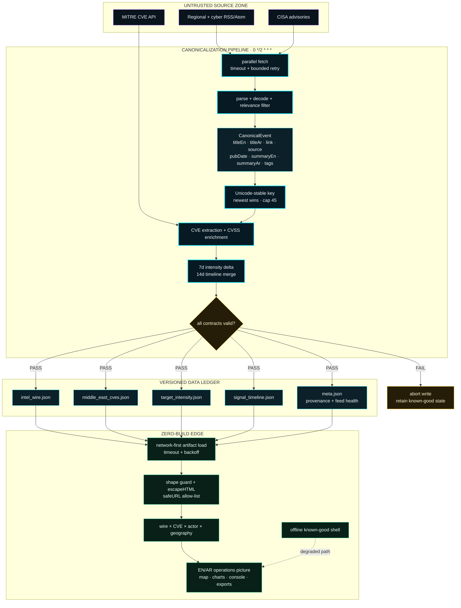
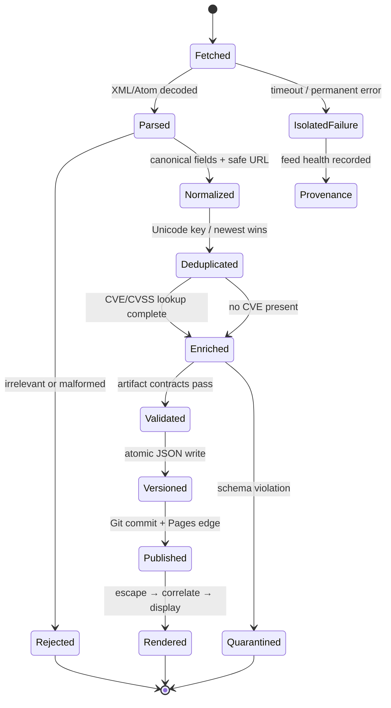
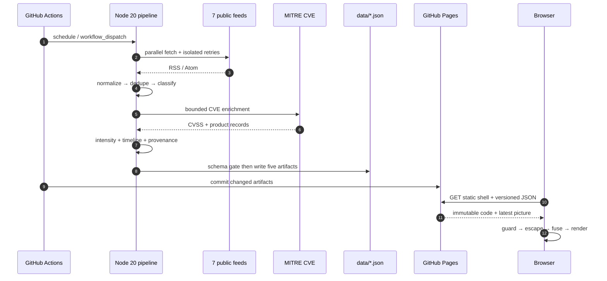

<div align="center">
  

# YASLOGIST // INTELLIGENCE

<a href="https://yaslogist.github.io/yaslogist-intelligence/"></a>

**SOVEREIGN CTI · MARITIME LOGISTICS RADAR · ZERO-BUILD EDGE RUNTIME**

[](https://yaslogist.github.io/yaslogist-intelligence/)
[](https://github.com/YASLOGIST/yaslogist-intelligence/actions/workflows/ci.yml)
[](https://github.com/YASLOGIST/yaslogist-intelligence/actions/workflows/update-data.yml)
[](https://github.com/YASLOGIST/yaslogist-intelligence/actions/workflows/kinetic-readme.yml)

`OBSERVE` **//** `CORRELATE` **//** `ANTICIPATE`
</div>

---

<div align="center">
<table>
<tr>
<td align="center"><b>INTEL WIRE</b><br/><a href="data/meta.json"></a></td>
<td align="center"><b>CVE MATRIX</b><br/><a href="data/meta.json"></a></td>
<td align="center"><b>GEO COVERAGE</b><br/><a href="data/meta.json"></a></td>
<td align="center"><b>EDGE STATUS</b><br/></td>
</tr>
<tr>
<td align="center"><b>EDGE TTFB</b><br/><a href="assets/readme-telemetry/site-latency.json"></a></td>
<td align="center"><b>QUALITY FLOOR</b><br/><a href="assets/readme-telemetry/quality.json"></a></td>
<td align="center"><b>SURFACE BUDGET</b><br/><a href="assets/readme-telemetry/surface.json"></a></td>
<td align="center"><b>RUNTIME</b><br/><a href="package.json"></a></td>
</tr>
</table>

[](https://github.com/YASLOGIST/yaslogist-intelligence/commits/main)
[](https://github.com/YASLOGIST/yaslogist-intelligence/graphs/commit-activity)
[](CHANGELOG.md)
[](https://github.com/YASLOGIST/yaslogist-intelligence)
</div>

> [!IMPORTANT]
> Open-source situational awareness, not a classified feed or emergency warning system. Scores and tags are analytical aids; verify consequential decisions against primary sources.

## `01 // OPERATING PICTURE`

<table>
<tr>
<td width="50%" valign="top">
<h3>SIGNAL PLANE</h3>
<ul>
<li>7 public cyber/regional feeds</li>
<li>RSS/Atom normalization and deduplication</li>
<li>MITRE CVE enrichment with bounded concurrency</li>
<li>7-day geographic intensity delta</li>
<li>14-day persistent signal timeline</li>
<li>Five schema-validated, versioned JSON artifacts</li>
</ul>
</td>
<td width="50%" valign="top">
<h3>OPERATOR PLANE</h3>
<ul>
<li>EN/AR interface with runtime LTR/RTL flip</li>
<li>Tactical map, chokepoints, corridors, range rings</li>
<li>Search, watchlist, URL-state sharing, CSV export</li>
<li>Actor × wire correlation and CVSS matrix</li>
<li>Offline shell with freshness escalation</li>
<li>Command palette and briefing/snapshot export</li>
</ul>
</td>
</tr>
<tr>
<td width="50%" valign="top">
<h3>TRUST PLANE</h3>
<ul>
<li>No browser secrets, app server, or database</li>
<li>Hostile feed text escaped before DOM insertion</li>
<li>HTTP(S)-only outbound link policy</li>
<li>CSP + exact-version SRI controls</li>
<li>Empty ingestion never replaces known-good wire</li>
<li>Git history is the rollback and audit ledger</li>
</ul>
</td>
<td width="50%" valign="top">
<h3>RENDER PLANE</h3>
<ul>
<li>Semantic HTML5 + vanilla ES modules</li>
<li>Leaflet 1.9.4 and Chart.js 4.4.7</li>
<li>Demand-driven native WebGL2 substrate</li>
<li><code>prefers-reduced-motion</code> honored end-to-end</li>
<li>GitHub Pages static edge deployment</li>
<li>Zero bundler; repository root is the artifact</li>
</ul>
</td>
</tr>
</table>

## `02 // CANONICAL EVENT MODEL`



<details>
<summary><b><code>EVENT_STATE_MACHINE // EXPAND</code></b></summary>



**Hard invariants:** empty cycles never overwrite the wire · every link is HTTP(S) · every external string is escaped · malformed artifacts fail before commit · stale data remains visible and explicitly marked.
</details>

## `03 // AUTONOMOUS DATA PATH`



## `04 // KINETIC ACTIVITY STREAM`

<div align="center">
  
  <br/>
  <sub><code>Platane/snk SVG factory · generated in-repository every 12 hours · no recorded media</code></sub>
</div>

<details>
<summary><b><code>QUALITY_GATE // 84 ASSERTIONS</code></b></summary>

| Gate | Command | Contract |
|:--|:--|:--|
| Syntax | `npm run check` | Application, ingestion, service worker, and tooling parse cleanly |
| Tests | `npm test` | 84 unit/integration/i18n/schema/static assertions; zero test dependencies |
| Data | `npm run validate:data` | 5/5 committed intelligence artifacts satisfy schema |
| Budget | `npm run budget` | Local runtime ≤ 1 MiB; scripts ≤ 2; stylesheets ≤ 4 |
| Security | `npm run scan` | Secret patterns, dangerous sinks, and external-script policy clean |
| Full lock | `npm run ci` | All gates execute serially; any defect returns non-zero |

</details>

<details>
<summary><b><code>REPOSITORY_MAP // EXPAND</code></b></summary>

```text
index.html                  semantic command surface + CSP/SRI pins
app.js                      controller, i18n, wire, CVE, actors, exports
threat-map.js               Leaflet tactical/geospatial layer
acid-squares-bg.js          demand-driven WebGL2 substrate
styles.css                  dark operator design system
smart-operations.css        console and analytical UI layer
update_data.js              autonomous ingestion orchestrator
lib/intel-core.cjs          pure canonicalization/scoring functions
lib/validate-data.cjs       shared artifact contracts
scripts/                    validation, budget, and security gates
tests/                      84 zero-dependency assertions
data/                       five committed intelligence artifacts
assets/                     generated UI, social, motion, and telemetry assets
.github/workflows/          CI, 2h ingest, and 12h kinetic factory
docs/ARCHITECTURE.md        verified behavioral specification
```

</details>

<details>
<summary><b><code>LOCAL_EXECUTION // EXPAND</code></b></summary>

```bash
git clone https://github.com/YASLOGIST/yaslogist-intelligence.git
cd yaslogist-intelligence
npm run ci
python3 -m http.server 8080
# open http://localhost:8080
```

| Command | Effect |
|:--|:--|
| `npm run ingest` | Refresh the five intelligence artifacts from public sources |
| `npm run card` | Regenerate the data-backed social card |
| `npm run icon` | Regenerate deterministic PWA icon assets |
| `npm run ci` | Execute the complete release gate |

</details>

## `05 // LIVE REPOSITORY TELEMETRY`

<div align="center">
  <a href="https://github.com/YASLOGIST/yaslogist-intelligence/actions"></a>
  <a href="https://github.com/YASLOGIST/yaslogist-intelligence"></a>
</div>

---

<div align="center">
  <code>STATIC BY DEFAULT // VERSIONED INTELLIGENCE // HOSTILE-INPUT AWARE // FAILURE TOLERANT</code><br/><br/>
  <a href="https://yaslogist.github.io/yaslogist-intelligence/">CONSOLE</a> ·
  <a href="docs/ARCHITECTURE.md">ARCHITECTURE</a> ·
  <a href="docs/AUDIT-2026-10.md">AUDIT</a> ·
  <a href="CHANGELOG.md">CHANGELOG</a>
</div>
