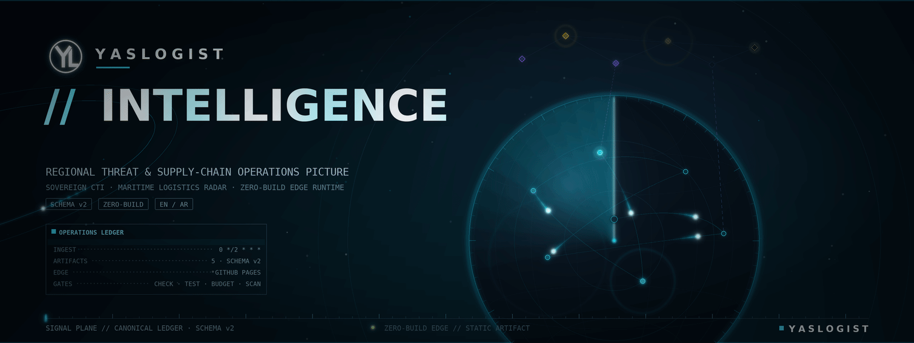
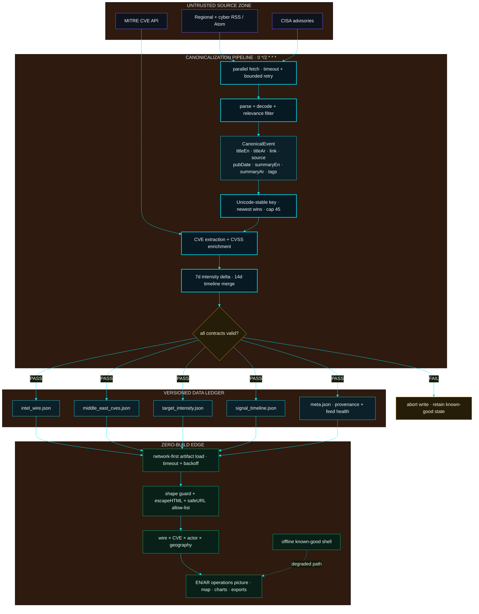
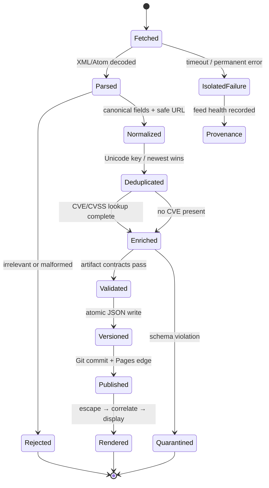
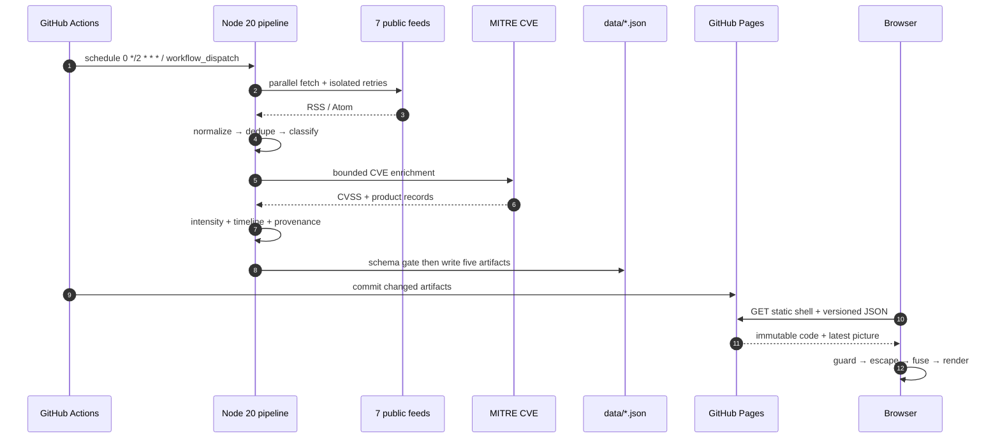
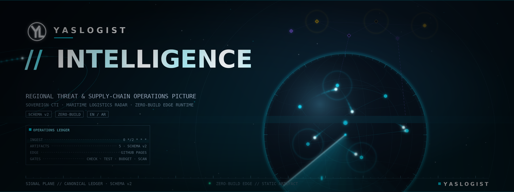

<div align="center">
  
</div>

<div align="center">
  

# YASLOGIST // INTELLIGENCE

<a href="https://yaslogist.github.io/yaslogist-intelligence/"></a>

**SOVEREIGN CTI · MARITIME LOGISTICS RADAR · ZERO-BUILD EDGE RUNTIME**

A static, bilingual (EN / AR) regional-threat and supply-chain operations picture.
Every number on screen derives from committed, schema-validated JSON; the pipeline
cannot silently ship malformed data; the UI degrades honestly offline.

[](https://yaslogist.github.io/yaslogist-intelligence/)
[](https://github.com/YASLOGIST/yaslogist-intelligence/actions/workflows/ci.yml)
[](https://github.com/YASLOGIST/yaslogist-intelligence/actions/workflows/update-data.yml)

`OBSERVE` **//** `CORRELATE` **//** `ANTICIPATE`
</div>

---

<div align="center">
<table>
<tr>
<td align="center"><b>INTEL WIRE</b><br/><a href="data/meta.json"></a></td>
<td align="center"><b>CVE MATRIX</b><br/><a href="data/meta.json"></a></td>
<td align="center"><b>GEO COVERAGE</b><br/><a href="data/meta.json"></a></td>
<td align="center"><b>EDGE STATUS</b><br/></td>
</tr>
<tr>
<td align="center"><b>QUALITY FLOOR</b><br/><a href="assets/readme-telemetry/quality.json"></a></td>
<td align="center"><b>SURFACE BUDGET</b><br/><a href="assets/readme-telemetry/surface.json"></a></td>
<td align="center"><b>EDGE TTFB</b><br/><a href="assets/readme-telemetry/site-latency.json"></a></td>
<td align="center"><b>RUNTIME</b><br/><a href="package.json"></a></td>
</tr>
</table>

[](https://github.com/YASLOGIST/yaslogist-intelligence/commits/main)
[](CHANGELOG.md)
</div>

> [!IMPORTANT]
> Open-source situational awareness, not a classified feed or emergency warning
> system. Scores, tiers, and tags are analytical aids; verify consequential
> decisions against primary sources.

<div align="center">
  
</div>

---

## `01 // THE SYSTEM`

Four planes compose the system. Each is independently testable and fails
without taking the others down.

<table>
<tr>
<td width="50%" valign="top">
<h3>SIGNAL PLANE</h3>
<ul>
<li>7 public cyber / regional feeds, parsed directly from source XML</li>
<li>RSS / Atom normalization with Unicode-stable dedupe (newest wins, cap 45)</li>
<li>MITRE CVE extraction with CVSS enrichment (bounded concurrency 3)</li>
<li>7-day geographic intensity delta vs the prior 7 days</li>
<li>14-day persistent signal timeline, merged across cycles</li>
<li>Five schema-validated, versioned JSON artifacts (schema v2)</li>
</ul>
</td>
<td width="50%" valign="top">
<h3>OPERATOR PLANE</h3>
<ul>
<li>EN / AR interface with runtime LTR / RTL flip and full dictionary parity</li>
<li>Tactical map: observed country signals + labelled reference geometry</li>
<li>Search, watchlist (PINNED), URL-state sharing, CSV + briefing export</li>
<li>Actor × wire fusion and CVSS-sorted CVE matrix</li>
<li>Command palette with eight single-key operator commands</li>
<li>Offline shell with explicit freshness escalation</li>
</ul>
</td>
</tr>
<tr>
<td width="50%" valign="top">
<h3>TRUST PLANE</h3>
<ul>
<li>No browser secrets, no app server, no database</li>
<li>Hostile feed text escaped before DOM insertion (<code>escapeHTML</code>)</li>
<li>HTTP(S)-only outbound link policy (<code>safeURL</code>)</li>
<li>Restrictive CSP + exact-version SRI on every external script</li>
<li>Empty ingestion never replaces the known-good wire</li>
<li>Git history is the rollback and audit ledger</li>
</ul>
</td>
<td width="50%" valign="top">
<h3>RENDER PLANE</h3>
<ul>
<li>Semantic HTML5 + vanilla ES modules; the repository root is the artifact</li>
<li>Leaflet 1.9.4 and Chart.js 4.4.7, both pinned with SRI</li>
<li>Demand-driven native WebGL2 substrate (no recurring idle frames)</li>
<li><code>prefers-reduced-motion</code> honored end-to-end, incl. the shader</li>
<li>Service-worker offline shell; GitHub Pages static edge deployment</li>
<li>Zero bundler, zero runtime dependencies in the app</li>
</ul>
</td>
</tr>
</table>

---

## `02 // SYSTEM BLUEPRINT`

The canonical event model. Untrusted sources are normalized into a validated,
versioned ledger; the zero-build edge renders only what passed the schema gate.



<details>
<summary><b><code>EVENT_STATE_MACHINE // EXPAND</code></b></summary>



**Hard invariants:** an empty cycle never overwrites the wire · every outbound
link is HTTP(S) · every external string is escaped · malformed artifacts fail
before commit · stale data remains visible and explicitly marked.

</details>

---

## `03 // AUTONOMOUS DATA PATH`



The browser is a **two-stage renderer**, never a source of truth:

| Stage | Source | Behaviour |
|:--|:--|:--|
| 1 — committed wire | `data/intel_wire.json` | Painted immediately; never rate-limited; authoritative |
| 2 — live overlay | 5 feeds via read-only proxy | Merged in parallel, deduplicated, timeboxed; optional and degrades silently |

Derived figures (KPIs, charts, briefing) are always recomputed from the same
in-memory items — never independent numbers.

---

## `04 // OPERATOR SURFACE`

Five isolated panels behind a WAI-ARIA tablist (roving tabindex, RTL-aware
arrows / Home / End) with hash deep links.

| Panel | Hash | What it does |
|:--|:--|:--|
| **Dashboard** | `#dashboard` | KPI band, honest progress meters, source-health cockpit, tag/sector charts, smart briefing |
| **Threat Map** | `#map` | Leaflet evidence map: 7 observed country nodes + 4 Esri base layers; reference routes / ranges / cables explicitly labelled non-live |
| **Intel Wire** | `#wire` | Priority wire with tag filters, PINNED watchlist, search (EN + AR), source strip, live-sync chip |
| **CVE Matrix** | `#cves` | CVSS-sorted exposure table, severity filters, search, RFC-4180 CSV export |
| **APT Dossiers** | `#actors` | 12 bilingual actor dossiers with wire-activity fusion and MITRE ATT&CK links |

Operator toolkit (all client-side, zero server state):

- **Watchlist** — star any wire item; persisted, bounded, hostile-storage safe.
- **Live sync** — 10-minute background refresh, skipped when hidden / offline.
- **Shareable views** — filter state travels in the hash; parser sanitizes input.
- **Exports** — JSON snapshot, Markdown handoff briefing, filtered CVE CSV.
- **Command palette** — eight advertised commands bound as real hotkeys.

<div align="center">
  
</div>

---

## `05 // IGNITION SEQUENCE`

The app is a static artifact; the pipeline is plain Node. Verified commands only.

```bash
git clone https://github.com/YASLOGIST/yaslogist-intelligence.git
cd yaslogist-intelligence

# Full release gate (syntax, 84 tests, schema, budget, security scan)
npm run ci

# Serve the static console
python3 -m http.server 8080   # open http://localhost:8080
```

<details>
<summary><b><code>LOCAL_EXECUTION // EXPAND</code></b></summary>

| Command | Effect |
|:--|:--|
| `npm run check` | Syntax-check every JS surface (app, pipeline, tooling, service worker) |
| `npm test` | 84 zero-dependency `node --test` assertions |
| `npm run validate:data` | Validate the five committed artifacts against schema |
| `npm run budget` | Enforce the ≤ 1 MiB local surface + external-asset caps |
| `npm run scan` | Secret / dangerous-sink / external-pinning security gate |
| `npm run ingest` | Refresh the five artifacts from public sources (network) |

Optional asset regeneration (not required to run): `npm run card` (OG image,
needs Pillow) and `npm run icon` (PWA icons, dependency-free).

</details>

---

## `06 // VERIFICATION LEDGER`

Every gate below is CI-enforced on Node 20 / 22 and reads from the repository
itself — nothing here is asserted by hand.

| Gate | Command | Contract |
|:--|:--|:--|
| Syntax | `npm run check` | Application, ingestion, service worker, and tooling parse cleanly |
| Tests | `npm test` | 84 unit / integration / i18n / schema / static-integrity assertions |
| Data | `npm run validate:data` | 5/5 committed intelligence artifacts satisfy schema |
| Budget | `npm run budget` | Local surface ≤ 1 MiB (currently ~407 KiB); scripts ≤ 2; stylesheets ≤ 4 |
| Security | `npm run scan` | Secret patterns, dangerous sinks, external-script pinning clean |
| Full lock | `npm run ci` | All gates serial; any defect returns non-zero |

<details>
<summary><b><code>REPOSITORY_MAP // EXPAND</code></b></summary>

```text
index.html                  semantic command surface + CSP / SRI pins
app.js                      controller, i18n, wire, CVE, actors, exports
threat-map.js               Leaflet tactical / geospatial layer
acid-squares-bg.js          demand-driven WebGL2 substrate
styles.css                  dark operator design system
smart-operations.css        console and analytical UI layer
sw.js                       offline shell + network-first data cache
update_data.js              autonomous ingestion orchestrator
lib/intel-core.cjs          pure canonicalization / scoring functions
lib/validate-data.cjs       shared artifact contracts
scripts/                    validation, budget, and security gates
tests/                      84 zero-dependency assertions
data/                       five committed intelligence artifacts
assets/                     generated UI, social, motion, telemetry assets
assets/readme/              cinematic README hero, poster, dividers, signature
.github/workflows/          CI (2h ingest · 12h kinetic) pipelines
docs/ARCHITECTURE.md        verified behavioral specification
docs/AUDIT-2026-10.md       ranked baseline audit + closure record
```

</details>

---

## `07 // ENGINEERING STATUS`

An honest ledger of what exists, what is verified, and what is deliberately absent.

| Class | Item | Status |
|:--|:--|:--|
| **Implemented · CI-verified** | Zero-build static shell, bilingual EN/AR UI, offline service-worker shell | `npm run ci` green on Node 20 / 22 |
| **Implemented · CI-verified** | 2-hour autonomous ingestion (`0 */2 * * *`) with schema gate before write | `update-data.yml` + `npm run validate:data` |
| **Implemented · CI-verified** | 84 zero-dependency tests; ≤ 1 MiB local surface budget; secret / sink / pinning scan | `npm test` · `npm run budget` · `npm run scan` |
| **Implemented · CI-verified** | Leaflet evidence map, CVE matrix, actor dossiers, exports, command palette | covered by operator-feature + i18n suites |
| **Analytical aid** | Scores, tiers, tags, intensity deltas, timelines | Decision support only — verify against primary sources |
| **Reference — not live** | Map reference routes / ranges / cables; opt-in simulated AIS layer | Explicitly labelled non-live in the UI |
| **Absent — by design** | App server, database, browser secrets, user accounts, classified data | Sovereign open-source edge; Git history is the audit ledger |

---

## `08 // KINETIC ACTIVITY STREAM`

<div align="center">
  
  <br/>
  <sub><code>generated in-repository every 12h · no recorded media</code></sub>
</div>

<div align="center">
  
</div>

---

## `09 // YASLOGIST`

<div align="center">
  
</div>

**YASLOGIST // INTELLIGENCE** is conceived, engineered, and art-directed by
[**YASLOGIST**](https://www.yaslogist.com) — a permanent creative signature
for a sovereign, zero-build approach to operational intelligence.

The cinematic hero, poster, dividers, and signature above are original assets
produced for this repository and stored under `assets/readme/`.

<details>
<summary><b><code>STATIC POSTER // FALLBACK FRAME</code></b></summary>

<div align="center">
  
</div>

</details>

<div align="center">
  <code>STATIC BY DEFAULT // VERSIONED INTELLIGENCE // HOSTILE-INPUT AWARE // FAILURE TOLERANT</code><br/><br/>
  <a href="https://yaslogist.github.io/yaslogist-intelligence/">CONSOLE</a> ·
  <a href="https://www.yaslogist.com">YASLOGIST</a> ·
  <a href="docs/ARCHITECTURE.md">ARCHITECTURE</a> ·
  <a href="docs/AUDIT-2026-10.md">AUDIT</a> ·
  <a href="CHANGELOG.md">CHANGELOG</a>
</div>

<div align="center">
  <sub>YASLOGIST · Crafted &amp; engineered at <a href="https://www.yaslogist.com">yaslogist.com</a> · zero-build · zero runtime dependencies</sub>
</div>
