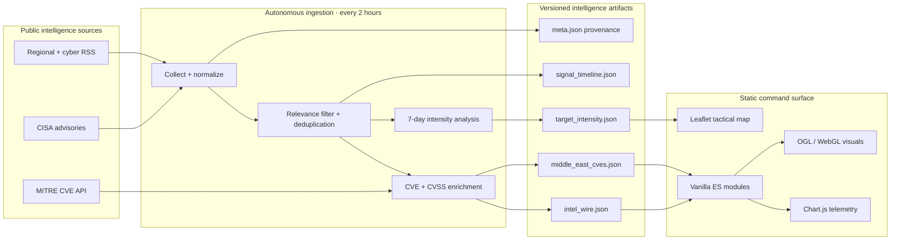

<div align="center">


# YASLOGIST Intelligence

### Sovereign CTI & Maritime Logistics Radar

**A bilingual, zero-build intelligence cockpit that turns open-source cyber, geopolitical, and maritime signals into an operator-ready common picture.**

[](https://yaslogist.github.io/yaslogist-intelligence/)
[](.github/workflows/update-data.yml)

[](package.json)
[](#bilingual-by-design)
[](#system-architecture)
[](#deploy)

[Launch Dashboard](https://yaslogist.github.io/yaslogist-intelligence/) · [Explore Architecture](#system-architecture) · [Run Locally](#quick-start) · [Inspect the Data](#intelligence-data)

</div>

---

## Intelligence, unified

YASLOGIST Intelligence is a high-density command interface for monitoring Middle East cyber activity, geopolitical developments, critical vulnerabilities, and maritime supply-chain risk. It combines a tactical map, normalized OSINT wire, CVE enrichment, target-intensity telemetry, and threat-actor context in one static application.

The browser receives preprocessed JSON—not API credentials or a server session. A scheduled Node.js pipeline collects and structures public intelligence, while GitHub Pages serves the resulting cockpit at the edge.

> [!IMPORTANT]
> YASLOGIST is an **open-source situational-awareness tool**, not a classified feed or an emergency warning system. Automated tags, scores, map layers, and DEFCON-style UI indicators are analytical aids. Validate consequential decisions against authoritative primary sources.

## Operational picture

| Capability | What it delivers |
| :--- | :--- |
| **Live intelligence wire** | Deduplicated cyber and regional reporting, searchable by keyword, CVE, region, or smart tag |
| **Tactical threat map** | Dark, satellite, ocean, and topographic basemaps with chokepoints, subsea infrastructure, corridors, and range overlays |
| **CVE defense matrix** | Feed-extracted CVE identifiers enriched with MITRE CVE records, CVSS scores, severity, and affected products |
| **Target intensity** | Rolling 7-day country-linked signal volume with comparison against the preceding window |
| **Maritime awareness** | Focus on Suez, Bab el-Mandeb, the Red Sea, and the Strait of Hormuz |
| **Operator console** | Searchable command palette, full-screen mode, JSON snapshot & Markdown briefing export, deep links, briefing recalculation |
| **Provenance & freshness** | Every artifact carries a manifest (`data/meta.json`); the footer shows true pipeline age with stale-state escalation |
| **Signal timeline** | Rolling 14-day signal-volume sparkline with honest 7-day vs prior-7-day delta |
| **Resilient display** | Committed data artifacts, timeout-aware requests with retry/backoff, offline state feedback, safe fallback content |
| **Accessible motion** | Progressive reveal, skeleton loading and KPI count-up — all disabled under `prefers-reduced-motion`; WebGL auto-tunes to the device frame rate |

### Command interface

Press <kbd>Ctrl</kbd>/<kbd>⌘</kbd> + <kbd>K</kbd> to open the operator console.

- Refresh the intelligence wire
- Export the current intelligence snapshot (JSON)
- Export the smart threat briefing (Markdown hand-off)
- Copy a deep link to the current view
- Switch between Arabic and English
- Jump directly to the threat map
- Enter full-screen command-center mode
- Recalculate the smart threat briefing

## System architecture



### Architecture principles

- **Static by default** — no application server, database, or runtime secret.
- **Zero-build frontend** — standards-based HTML, CSS, and JavaScript modules; the repository is the deployable artifact.
- **Versioned intelligence** — generated telemetry is committed as inspectable JSON with history and provenance.
- **Failure tolerant** — individual feed failures do not terminate an ingestion cycle; existing data remains available when no fresh wire resolves.
- **Untrusted-input aware** — feed values are HTML-escaped and outbound URLs are protocol allow-listed before rendering.
- **Schema-guarded artifacts** — every committed JSON is validated before commit (shared validators, CI-enforced).
- **Progressive visual stack** — core intelligence remains usable if the optional WebGL background cannot initialize; an FPS watchdog steps the shader down before it can jank the interface.

## Intelligence pipeline

The scheduled workflow runs at `0 */2 * * *` and can also be started manually from GitHub Actions.

```text
Fetch feeds in parallel
        ↓
Parse RSS / Atom directly from source XML
        ↓
Filter for regional, cyber, and maritime relevance
        ↓
Normalize · classify · deduplicate · sort
        ↓
Extract CVE IDs and enrich against MITRE (capped concurrency)
        ↓
Calculate rolling country intensity + 14-day signal timeline
        ↓
Write 5 JSON artifacts (incl. provenance manifest)
        ↓
Validate artifacts against schema, then commit changed data
```

### Monitored source classes

The current collector includes BBC Middle East, Al Jazeera, Reuters, BleepingComputer, The Hacker News, Dark Reading, and CISA advisories. Source availability and upstream formats can change; the pipeline uses per-feed isolation so one unavailable source does not block the remaining collection.

### Smart classification

Items are labeled from their normalized text with operator-friendly categories including:

`RANSOMWARE` · `ZERO-DAY` · `MARITIME` · `DDoS` · `APT` · `INTEL`

Classification is deterministic and explainable. It is keyword-driven—not a claim of attribution or machine-confirmed intent.

## Intelligence data

| Artifact | Purpose | Key contents |
| :--- | :--- | :--- |
| [`data/intel_wire.json`](data/intel_wire.json) | Normalized intelligence stream | Titles, summaries, source, publication time, link, bilingual fields, tags |
| [`data/middle_east_cves.json`](data/middle_east_cves.json) | Vulnerability matrix | CVE ID, product/vendor, severity, CVSS score, display badge |
| [`data/target_intensity.json`](data/target_intensity.json) | Geographic signal telemetry | Country, current/previous volume, delta %, intensity level |
| [`data/meta.json`](data/meta.json) | Provenance manifest | Generation time, per-feed health, artifact counts, newest wire timestamp |
| [`data/signal_timeline.json`](data/signal_timeline.json) | 14-day trend | Daily UTC signal buckets (merged across cycles, never erased) |

The collector retains up to **45 wire items** and **8 enriched CVE records** per generated snapshot. Country intensity currently evaluates Israel, Iran, Lebanon, Syria, Yemen, Jordan, and Egypt over rolling 7-day windows.

## Bilingual by design

Arabic and English are first-class interface modes rather than separate builds.

- Instant language switching without reload
- Runtime `dir="rtl"` / `dir="ltr"` adaptation
- Localized navigation, metrics, map labels, advisories, filters, and operator states
- Arabic-focused typography via Cairo and IBM Plex Sans Arabic
- Language preference persisted in the browser

> Upstream article titles and summaries may remain in their source language. Interface localization does not imply automated translation of third-party reporting.

## Quick start

### Requirements

- A modern browser with ES module support
- Node.js **20+** only if running validation or ingestion
- A local HTTP server (ES modules and JSON loading should not be opened through `file://`)

### 1. Clone

```bash
git clone https://github.com/YASLOGIST/yaslogist-intelligence.git
cd yaslogist-intelligence
```

### 2. Serve the static app

Use any static server. For example:

```bash
python3 -m http.server 8080
```

Open **http://localhost:8080**.

### 3. Run the full verification gates

```bash
npm run check          # syntax-check every JS artifact
npm test               # 56 assertions: unit, integration, i18n, schema, static integrity
npm run validate:data  # schema-validate committed intelligence artifacts
npm run budget         # performance budget gate
npm run scan           # security scan (secrets, sinks, external-script policy)
npm run ci             # all of the above, one command
```

### 4. Refresh intelligence data locally

```bash
npm run ingest
```

This command makes outbound requests to the configured public feeds and the MITRE CVE API, then updates files under `data/`. Review the resulting diff before committing.

## Deploy

Because the application has no build step, deploy the repository root to any static host.

### GitHub Pages

1. Open **Settings → Pages** in the repository.
2. Select deployment from a branch.
3. Publish the repository root from the intended branch.
4. Keep the scheduled ingestion workflow enabled so committed telemetry remains current.

### Other static platforms

Use `.` as the publish directory and leave the build command empty. Ensure the host serves JSON and JavaScript module files with standard MIME types.

## Technology matrix

| Layer | Technology |
| :--- | :--- |
| Interface | Semantic HTML5, CSS3, vanilla JavaScript ES modules |
| Mapping | Leaflet 1.9.4 with Esri basemap services |
| Telemetry | Chart.js |
| Visual engine | OGL / WebGL with graceful fallback |
| Typography & icons | Google Fonts, Font Awesome |
| Ingestion | Node.js 20 native `fetch`, filesystem APIs, direct XML parsing |
| Automation | GitHub Actions scheduled workflow |
| Hosting | Static web hosting / GitHub Pages |

## Repository map

```text
.
├── index.html                    # Command-center shell (CSP, ARIA tabs, SRI pins)
├── app.js                        # UI, i18n, telemetry, filtering, console (testable exports)
├── threat-map.js                 # Tactical geospatial layers
├── acid-squares-bg.js            # WebGL visual engine (FPS watchdog, reduced-motion frame)
├── styles.css                    # Core design system + motion tokens
├── smart-operations.css          # Operator-console enhancements
├── update_data.js                # Autonomous intelligence collector (thin orchestration)
├── lib/
│   ├── intel-core.cjs            # Pure pipeline logic (unit tested)
│   └── validate-data.cjs         # Shared artefact validators
├── scripts/
│   ├── validate-data.cjs         # CLI: data gate
│   ├── perf-budget.cjs           # CLI: performance budget gate
│   └── security-scan.cjs         # CLI: secrets/sinks/pinning gate
├── tests/                        # node:test suite (zero dependencies)
├── docs/                         # Architecture, behavioural spec, audit
├── data/                         # 5 versioned generated intelligence artefacts
├── assets/                       # Brand assets (optimized 128px variant used in-app)
├── archive/legacy/               # Retired one-off scripts & duplicates (not loaded)
├── perf-budget.json              # Published performance budget
└── .github/workflows/
    ├── ci.yml                    # Verify matrix + hygiene (push/PR)
    └── update-data.yml           # Two-hour ingestion + schema validation
```

## Security and data integrity

- No API keys are required by the deployed browser application.
- External feed content is treated as untrusted and escaped before HTML rendering.
- Article links are restricted to HTTP and HTTPS protocols.
- A restrictive Content-Security-Policy is delivered via meta tag (no inline scripts, no forms, no objects).
- External scripts are pinned to exact versions with Subresource Integrity; CI fails on violations.
- Network requests use timeouts; the pipeline adds bounded retries with exponential backoff (transient errors only).
- External map tiles, fonts, icons, charts, and WebGL modules remain subject to their providers' availability and terms.
- The ingestion job writes only when useful data resolves; an empty collection does not overwrite the existing wire.

If you discover a security issue, report it privately to the repository owner rather than opening a public exploit report.

## Contributing

Contributions that improve source reliability, localization, accessibility, data validation, mapping accuracy, and operator experience are welcome.

1. Fork the repository and create a focused branch.
2. Make the smallest coherent change.
3. Run `npm run ci` (syntax + tests + data schema + budget + security scan).
4. If the collector changed, run `npm run ingest` and inspect generated data carefully.
5. Open a pull request explaining the operational impact and test evidence.

Please avoid presenting simulated or inferred telemetry as verified fact. New intelligence sources should be public, attributable, legally accessible, and resilient enough for automated collection.

---

<div align="center">

**YASLOGIST DEFENSE SYSTEMS**

`OBSERVE // CORRELATE // ANTICIPATE`

Built for cyber, geopolitical, and maritime situational awareness.

© 2026 YASLOGIST. All rights reserved.

</div>
