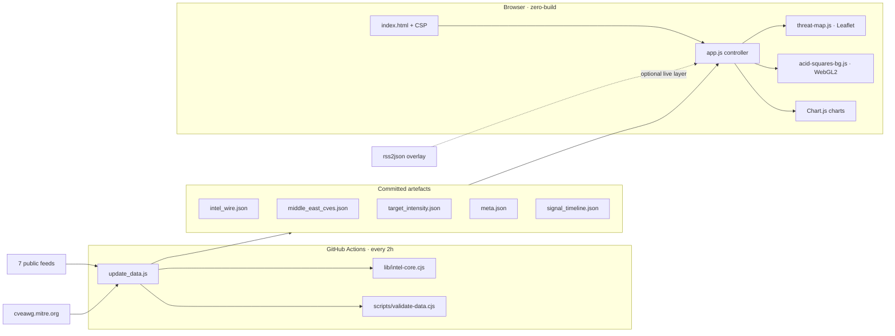
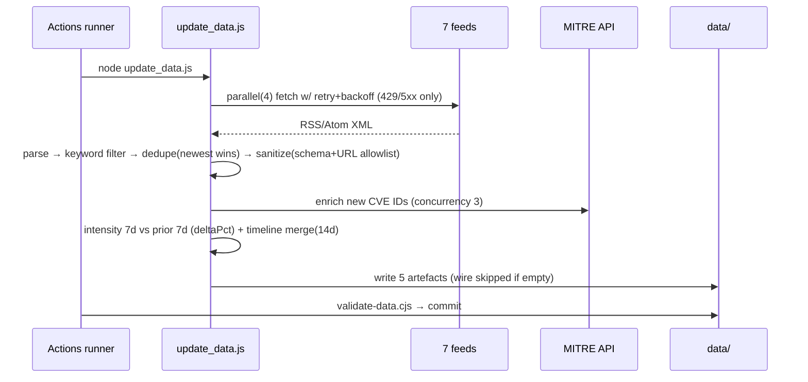

# YASLOGIST Intelligence — Reconstructed Architecture & Behavioural Specification

> Reverse-engineered and verified on 2026-10-01 against commit `aa96544` + the v1.1 upgrade.
> Every claim below traces to a file/line or a running-software observation.

## 1. Classification

Static, zero-build, bilingual (EN/AR) cyber-threat-intelligence dashboard + scheduled Node.js data pipeline, deployed to GitHub Pages. Category: **web app / OSINT aggregation pipeline**.

## 2. Definition of success

Operators open one static URL and see a **honest, current, bilingual** common picture — wire, map, CVE matrix, actor dossiers — where every number derives from committed, schema-validated artefacts; the system degrades gracefully offline/on weak devices; the pipeline cannot silently ship malformed data; and the codebase is testable, auditable, and free of dead weight.

## 3. Stack fingerprint

| Component | Evidence | Status |
| :-- | :-- | :-- |
| Vanilla ES modules, no bundler | `index.html` script tags; no build config | CONFIRMED |
| Leaflet 1.9.4 + Esri tiles | `index.html`, `threat-map.js` tile URLs | CONFIRMED |
| Chart.js 4.4.7 UMD | `index.html` (pinned + SRI) | CONFIRMED |
| Native WebGL2 fullscreen triangle | `acid-squares-bg.js` | CONFIRMED |
| Node >= 20 pipeline, native fetch | `update_data.js`, `package.json` engines | CONFIRMED |
| GitHub Actions cron `0 */2 * * *` | `.github/workflows/update-data.yml` | CONFIRMED |
| rss2json browser overlay (read-only proxy) | `app.js fetchSingleFeed` | CONFIRMED |
| MITRE CVE AE API for CVSS enrichment | `update_data.js fetchCVEInfo` | CONFIRMED |

## 4. Component diagram

## 5. Key flows

### 5.1 Ingest cycle (pipeline)

### 5.2 Wire render (browser, two-stage)
Stage 1: `data/intel_wire.json` paints immediately → Stage 2: rss2json overlay merges in parallel `Promise.allSettled` → dedupe (newest wins, Unicode keys) → render with `escapeHTML` + `safeURL` → KPIs/model tier/charts/briefing recompute from the same in-memory items (never independent numbers).

### 5.3 Analytical model-tier derivation
`critical >= 3 → tier 2 · critical >= 1 or high >= 5 → tier 3 · else tier 4`. This is an internal prioritization heuristic, not an official readiness condition. Readout + tier + tooltip resolve per level in both languages (5 levels mapped).

### 5.4 Motion discipline
Transform/opacity only. `prefers-reduced-motion` → CSS animations ~0ms, shader renders one static frame, reveals instant-show. The WebGL2 substrate is demand-driven: one fullscreen triangle renders on boot, resize, and while pointer parallax settles, then cancels its RAF. It has no textures, render targets, fragment loops, or recurring idle submissions; DPR is capped at 2.

### 5.5 Tab + deep-link flow
Tabs are a WAI-ARIA tablist (roving tabindex, arrows/Home/End, RTL-aware). Selection maps to `#dashboard|map|wire|cves|actors` hashes (replaceState, hashchange listener) and persists to localStorage with the wire filter and language.

## 6. Behavioural invariants (testable, all covered in `tests/`)

1. Empty ingest cycle never overwrites `intel_wire.json` (`update_data.js`).
2. Every persisted wire item passes `sanitizeWireItem`: non-empty title, http(s) link, numeric pubDate, ≤3 tags.
3. Rendering inserts no raw external markup: `escapeHTML` + `safeURL` (XSS test).
4. EN and AR dictionaries contain identical key sets; every `data-i18n*` attr in `index.html` resolves (i18n test).
5. `target_intensity.json` rows carry `attacks`, `previous`, `deltaPct`; trends compute from both windows (app-logic test asserts a *negative* delta renders).
6. CVE table sorts by CVSS desc by default; severity filter never yields a silent empty table (empty-state cell).
7. Pipeline meta is written on every run, including quiet cycles.
8. External scripts are pinned to exact versions + SRI or the build fails (static-integrity + security-scan).
9. Performance budget: total local surface ≤ 1 MiB, per-file caps, ≤2 external scripts (budget script).
10. All numbers shown trace to wire/CVE/intensity data or are labelled placeholders (`AWAITING TELEMETRY`).

## 7. Evidence table

| Claim | Evidence | Confidence |
| :-- | :-- | :-- |
| Old KPI trends were fabricated constants | git show aa96544:index.html (`+14.2%`, `APT33 / CIR`) | CONFIRMED |
| DEFCON readout lied at level 4 | git show aa96544:app.js `setDefconLevel` else-branch | CONFIRMED |
| Arabic-only titles were dropped by dedupe | old `dedupeKey` regex `[^a-z0-9]` | CONFIRMED |
| Tile attribution disabled (ToS risk) | old `threat-map.js` `attributionControl: false` | CONFIRMED |
| Chart.js was unpinned | old `index.html` jsdelivr `/chart.js` | CONFIRMED |
| Logo was 1723×1723 @ 266 KB rendered at 64 px | PIL measurement | CONFIRMED |
| 18 one-shot scripts + 5 dead HTML/data duplicates | repo inventory, checksums identical | CONFIRMED |
| `extractCvss` reads CNA then ADP, v4>v3.1>v3>v2 | `lib/intel-core.cjs` + unit test | CONFIRMED |
| Browser overlay depends on rss2json availability | `app.js fetchSingleFeed` | CONFIRMED |
| Slot-machine numbers dated KPI cards (pre-fix) | `updateRealTelemetry` post-fix paints real ratios | CONFIRMED |

## 8. Unknowns & cheapest resolution

| Unknown | Cheapest resolution |
| :-- | :-- |
| True browser FPS on low-end devices | Run Lighthouse/WebPageTest from CI runner; the renderer has a conservative one-pass/demand-driven budget but device-specific compositing still needs measurement |
| rss2json quota/ToS for production volume | Replace with tiny CORS-friendly worker or drop Stage 2 (Stage 1 wire stays live via Actions) |
| Esri tile ToS for sustained traffic | Register Esri developer key or migrate to self-hosted tiles; attribution now compliant |
| Arabic feed parity (currently EN-heavy upstream) | Add Arabic RSS sources to `FEEDS` (one-line config each) |

## 9. v1.3 operator layer (addendum, 2026-10-02)

Added on top of the specification above, all client-side and zero-build:

| Layer | Contract | Invariant kept |
| :-- | :-- | :-- |
| Watchlist (`PINNED`) | Star toggles on wire items; ids persisted in `localStorage` (`yaslogist.pinned`, ≤200, sanitized on load) | Static by default — no server state; hostile storage cannot crash boot |
| Live sync | `setInterval` 10 min, skipped when `document.hidden` or offline; stale-on-focus triggers one immediate fetch | Failure tolerant — a failed cycle leaves the last wire untouched |
| Hash wire state | `#wire?tag=X&q=Y` via `serializeWireState`/`parseWireState`; `history.replaceState` (no history spam) | Untrusted-input aware — tag restricted to `A-Z0-9_-`, query stripped of markup, both length-bounded; unit-tested |
| CVE tooling | `filteredCVEs()` single pipeline for table + CSV export (RFC 4180 quoting) | Every number traces to committed CVE artefacts |
| Actor × wire fusion | `actorWireActivity(actor, items)` alias match over live wire; ATT&CK links use known group pages, search fallback otherwise | Dossier claims stay data-derived: activity chips count real wire text matches |
| Search highlighting | `highlightHTML(text, term)` — offsets located on the raw string, then escaped; matches wrapped in `<mark>` | Untrusted-input aware — XSS containment unit-tested |
| Honest KPI bars | Widths = active-country share / APT share / peak CVSS / maritime share, each with `role="progressbar"` + bilingual tooltip | Same doctrine that removed the fabricated trend constants in v1.1 |
| PWA surface | `manifest.webmanifest` + generated icons (`assets/generate-app-icon.py`, pure-Python PNG encoder) | Zero-build, zero dependencies, no CSP change (same-origin fetch only) |

Pipeline note: Reuters public RSS was retired upstream (404 every cycle); the feed now
mirrors their Middle East coverage via Google News RSS. Per-feed isolation (unchanged)
means a dead mirror degrades exactly like the dead original did — never fatally.
